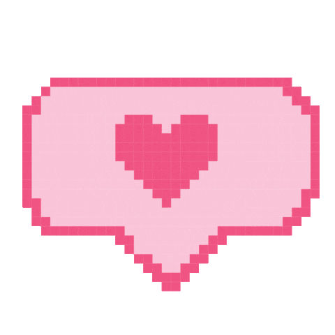

#  Hi there!

 I’m Vie, currently a Front End Developer student at [Medieinstitutet](https://github.com/medieinstitutet) with a creative background in graphic design and video editing. I've previously worked in various customer service roles, which have helped me develop strong communication and problem-solving skills, as well as understanding user needs. I’m all about tech and always excited to learn new things! 

## 
 My Tech Stack

  
| 💻 Programming | 🛠️ Tools & Frameworks | ✨ Frontend | 🎨 Design |
| -------------- | ---------------------- | ----------- | ---------- |
|   |    |     |   |

|  Currently learning |
| ------------------ |
|   |

<!-- |  |  |
| --- | -- |
| <strong>💻 Programming</strong> |   |
| <strong>🛠️ Tools & Frameworks</strong> |    |
| <strong>✨ Frontend</strong> |     |
| <strong>🎨 Design</strong> |   | -->

 

###  I'm also fluent in –
  English &nbsp;  Swedish &nbsp;  Vietnamese

 

## 
 If you'd like to collaborate, please reach out to me at  

